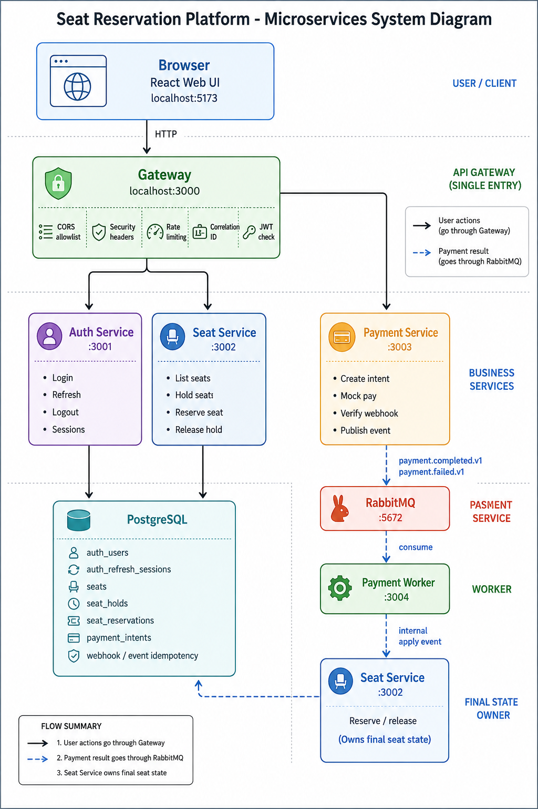

# seat-reservation-platform

TypeScript seat reservation platform with authentication, 90-day sessions, seat selection, mock payment flow, and reservation completion after payment.



## Status

Runnable TypeScript microservices implementation for the technical assessment.

## Target Shape

- `auth-service`: login, refresh sessions, logout, session security.
- `seat-service`: seat availability, hold, reservation, concurrency control.
- `payment-service`: mock payment intent and webhook handling.
- `gateway`: public API entry point for the client.
- `web`: optional public UI.
- `packages`: shared TypeScript types, event contracts, logger/config helpers.
- `infra`: broker, database, nginx, and deployment configuration.

## Local Run

```bash
npm install
npm run lint
npm test
npm run build
docker compose up --build
```

Open `http://localhost:5173`.

Demo account:

- email: `demo@example.com`
- password: `Password123!`

Run live happy-path E2E after Compose is up:

```bash
LIVE_E2E=1 npm run test:e2e
```

## Service Ports

| Service | Port |
| --- | --- |
| Gateway | `3000` |
| Auth service | `3001` |
| Seat service | `3002` |
| Payment service | `3003` |
| Payment worker | `3004` |
| Web | `5173` |

## Implemented Flow

Authenticated user logs in, sees 3 seeded seats, holds one seat, creates a server-priced mock payment intent, completes payment, and `payment-worker` consumes RabbitMQ `payment.completed.v1` to reserve the held seat.

Payment failure publishes `payment.failed.v1` and releases the hold.

## Review Evidence

- RabbitMQ is used for payment business events.
- Refresh token is an opaque httpOnly cookie and is never returned in JSON.
- Password hashing uses Argon2id.
- Webhook endpoint verifies HMAC and timestamp freshness.
- Seat holds use Postgres row locks plus partial unique indexes.
- Each service has `/health/live`, `/health/ready`, Dockerfile, and its own port.
- Decisions live in `docs/decisions/`.

## Working Docs

- [Assignment Brief](docs/specs/assignment-brief.md)
- [Functional Specification](docs/specs/functional-spec.md)
- [Review Checklist Map](docs/review/review-checklist-map.md)
- [Common Best Practices](docs/review/common-best-practices.md)
- [Scoring Guide](docs/review/scoring-guide.md)
- [Quick Scan](docs/review/quick-scan.md)
- [Architecture Notes](docs/architecture/architecture-notes.md)
- [Saga And Compensation](docs/architecture/saga-compensation.md)
- [Development Guardrails](docs/guardrails/development-guardrails.md)
- [Project Structure](docs/development/project-structure.md)
- [Implementation Roadmap](docs/roadmap/IMPLEMENTATION_ROADMAP.md)
- [Epic Vision](docs/roadmap/EPIC.md)
- [Docker Compose Notes](docs/operations/docker-compose.md)
- [Reviewer Runbook](docs/operations/reviewer-runbook.md)
- [Decisions](docs/decisions/README.md)
